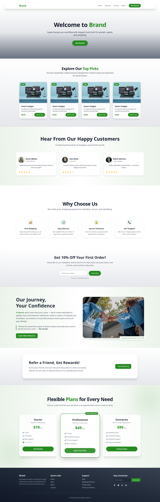
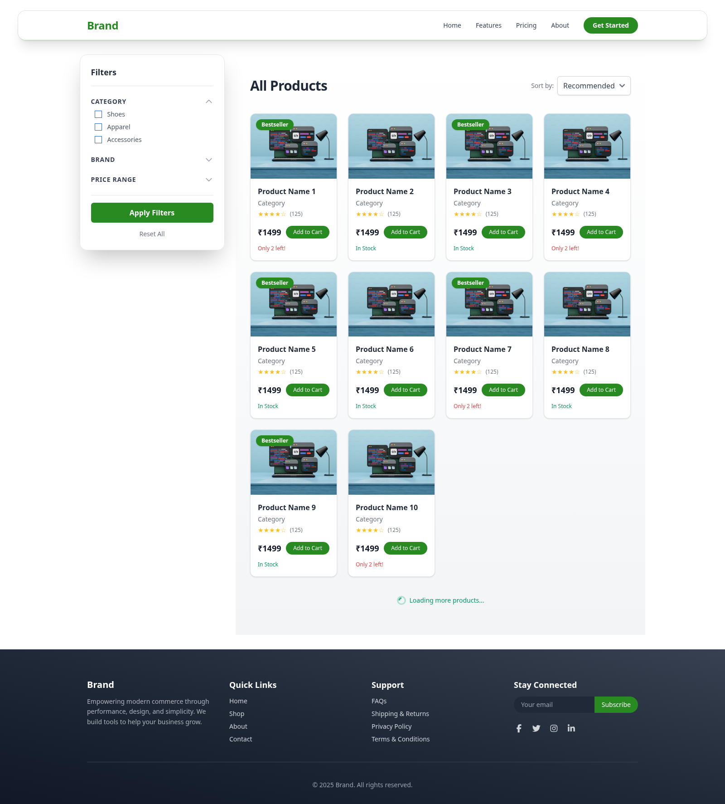
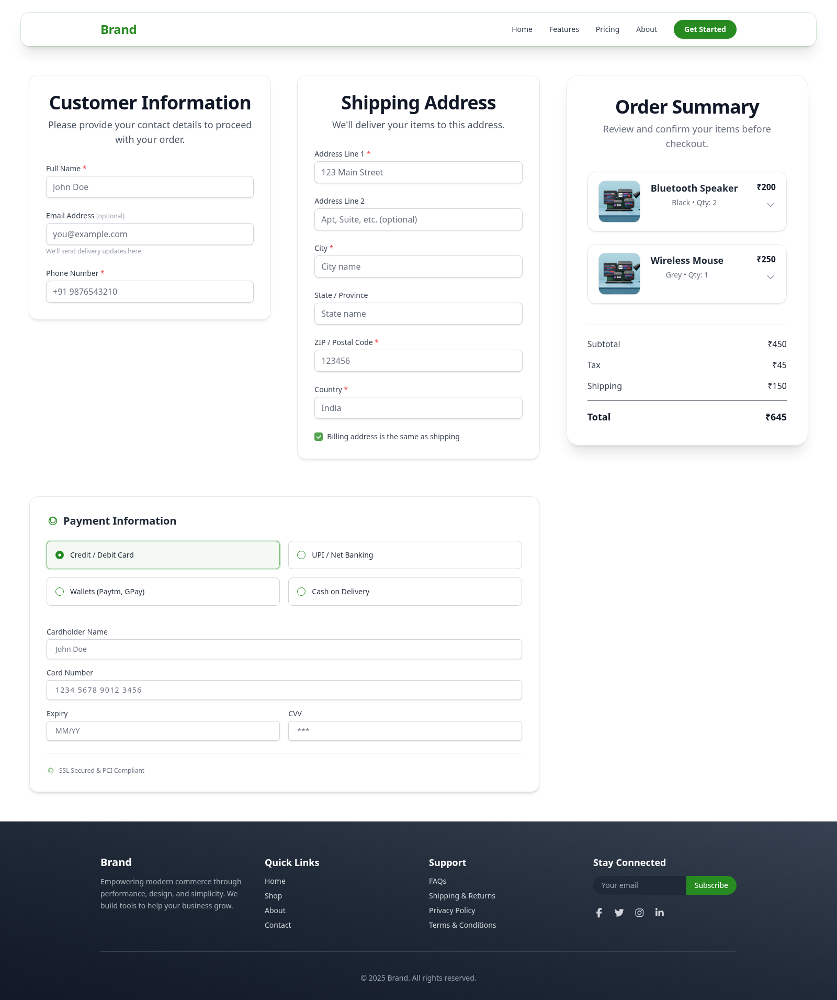
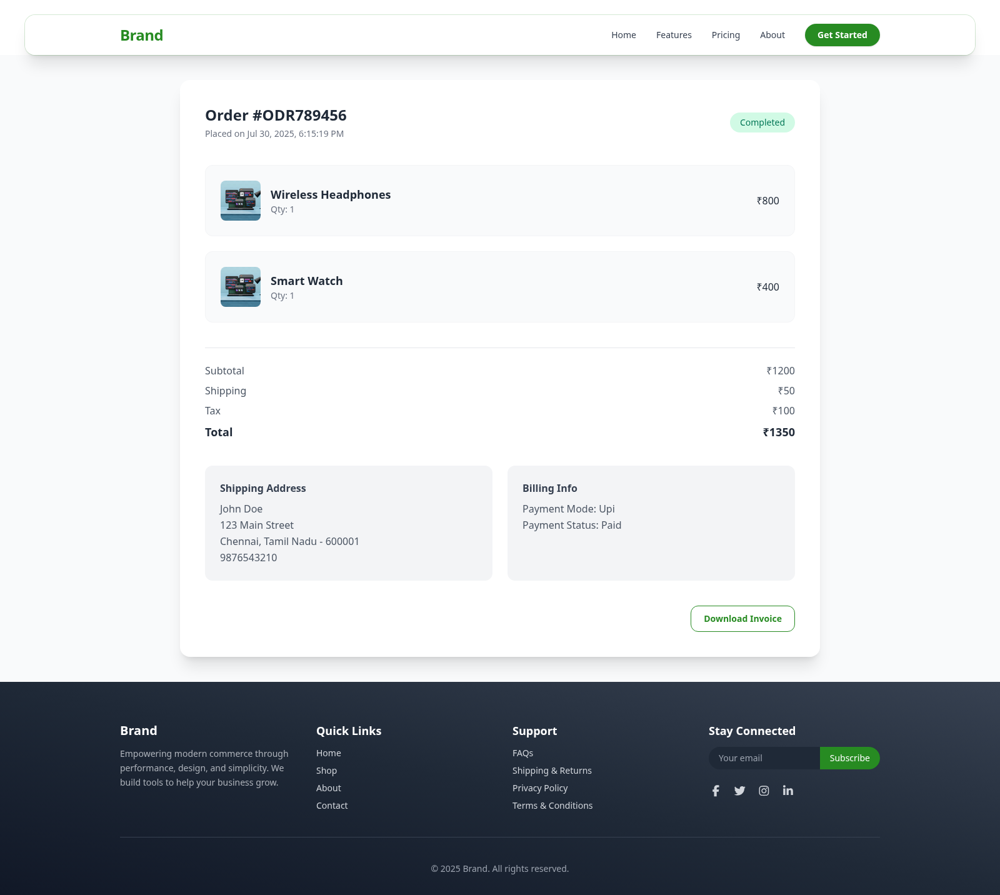
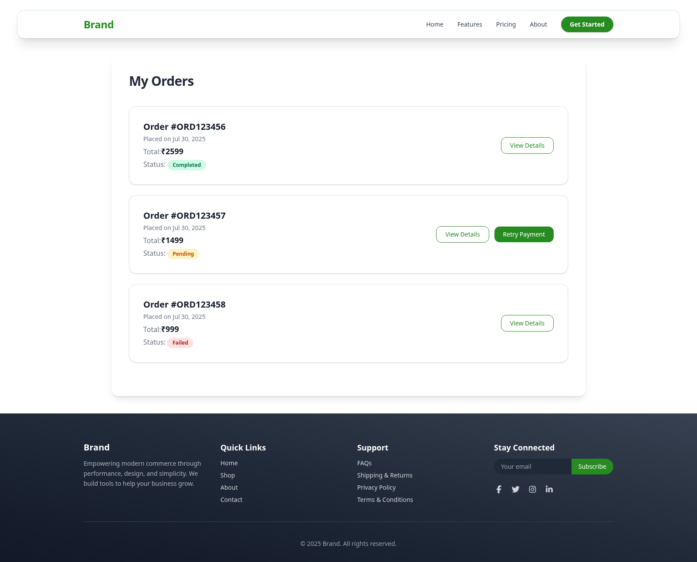
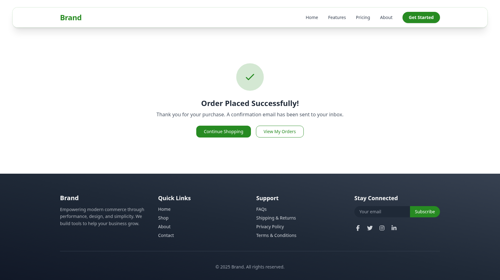
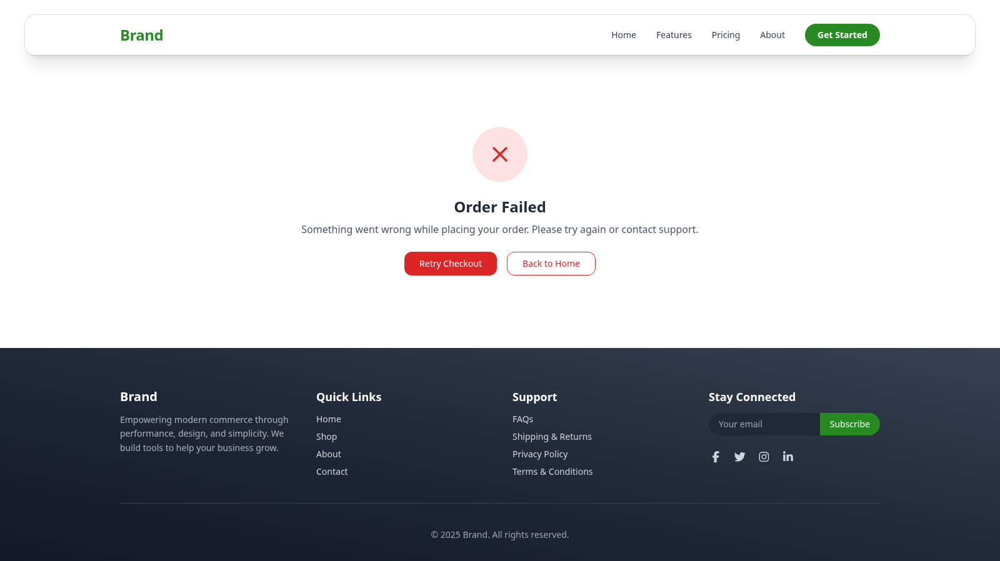

# 🛒 Modern Angular eCommerce Platform

A fully responsive and modular eCommerce platform built with Angular, utilizing modern UI/UX practices and dynamic component-based architecture. This project is optimized for performance and scalability, with support for order processing, checkout, product listing, and more.

---

## 🚀 Tech Stack

- **Framework**: Angular 20
- **Styling**: Tailwind CSS (customized utility-first)
- **Architecture**: Standalone Angular Components
- **Routing**: Angular Router with route metadata
- **Responsiveness**: Fully responsive using Tailwind breakpoints (`sm`, `md`, `lg`, `xl`, `2xl`)
- **Browser Support**: Chrome, Firefox, Edge, Safari

---

## 📂 Project Structure


```

src/
└── app/
├── component/
│   ├── checkout/
│   │   ├── customer-information-component/
│   │   ├── order-summary-component/
│   │   ├── payment-info-component/
│   │   └── shipping-info-component/
│   ├── landing/
│   │   ├── banner-component/
│   │   ├── brand-story-component/
│   │   ├── choose-us-section/
│   │   ├── featured-products/
│   │   ├── news-letter-component/
│   │   ├── pricing-component/
│   │   ├── refer-friend-component/
│   │   └── testimonial-component/
│   ├── layout/
│   │   ├── footer-component/
│   │   └── navbar-component/
│   └── order/
│       ├── order-list-component/
│       ├── over-view-component/
│       └── status/
├── pages/
│   ├── landing/
│   ├── products/
│   │   ├── product-listing/
│   │   ├── product-details/
│   │   └── checkout/
│   └── order/
│       ├── orders/
│       ├── order-placed-status/
│       └── order-view/

````

Each component is **standalone** and adheres to Angular’s modern composition API. Shared logic and UI are abstracted efficiently across modules.

---

## 🌐 Routing Configuration

Routes are defined in `src/app/routes.ts`:

```ts
export const routes: Routes = [
  { path: '', component: LandingPage, data: { isStickyNavbar: true } },
  { path: 'products', component: ProductListing },
  { path: 'checkout', component: Checkout },
  { path: 'order-completed/:status', component: OrderPlacedStatus },
  { path: 'orders', component: Orders, data: { isStickyNavbar: true } },
  { path: 'order/view', component: OrderView, data: { isStickyNavbar: true } },
];
````

### Dynamic Routing Example:

* `/order-completed/success` → Success message
* `/order-completed/failed` → Failure message

`isStickyNavbar: true` adds sticky behavior to navbar conditionally.

---

## 🎨 UI & Theme Customization

* **Theme**: Tailwind-based with customized `tailwind.config.js`
* **Palette**:

  * Primary: `oklch(0.5603 0.1677 142.41)`
  * Gray shades for text and backgrounds
  * Accent highlights on hover

### Custom Variants:

Hover and responsive variants have been extended for flexibility:

```ts
// styles.css
@theme {
  --color-primary: oklch(0.5603 0.1677 142.41);
  /* --color-primary: oklch(0.7 0.2615 326.65); */
  /* --color-radiant: oklch(0.8015 0.2171 146.65); */
}
```

### Reusable Design Patterns:

* Utility-first layout with `flex`, `grid`, `gap`, and `space-y-*`
* Cards, badges, and buttons use rounded corners, shadows, and smooth transitions
* Mobile-first breakpoints ensure all views adapt from `sm` to `2xl` screens

---

## 📦 Major Pages & Features

### 🏠 Landing Page (`/`)

* Hero banner, testimonials, pricing section, and featured products
* Modular `landing/` components like `choose-us-section`, `refer-friend`, etc.

### 🛍️ Product Listing (`/products`)

* Filters (category, rating, price)
* Product cards with image, name, price, and hover effects
* Paginated grid layout

### 📦 Product Details (`/products/:id`)

* Product gallery with zoom
* Detailed specs, availability, and pricing
* Add to cart / Buy Now logic (component not shown above)

### 💳 Checkout Page (`/checkout`)

* Modular steps:

  * Customer Info
  * Shipping Info
  * Payment Info
  * Order Summary
* Responsive accordion/card layout for each step

### ✅ Order Status (`/order-completed/:status`)

* Displays success/failure status
* Illustrations and CTA to return to homepage or view orders

### 📄 Order List (`/orders`)

* Tabular or card-based layout
* Status badges, summary info, and view buttons

### 📋 Order View (`/order/view`)

* Shows order-level details: customer, shipping, payment, product list
* Integrated with `status`, `summary`, and overview components
* Clean, detailed, and mobile-optimized layout

---

## 📱 Responsiveness

This application is **fully responsive** and tested across screen sizes:

| Device     | Status            |
| ---------- | ----------------- |
| Mobile     | ✅ 100% responsive |
| Tablet     | ✅ 100% responsive |
| Desktop    | ✅ Full layout     |
| Ultra-Wide | ✅ Fluid grids     |

Responsive design is ensured using Tailwind's `sm`, `md`, `lg`, `xl`, `2xl` classes throughout the layout.

---

## 🔄 Infinite Scroll in Product Listing
Implemented using Angular's IntersectionObserver:

```
Setup in product-listing-component.ts:

setupInfiniteScroll() {
    this.observer = new IntersectionObserver(
      ([entry]) => {
        if (entry.isIntersecting) {
          this.loadMoreProducts();
        }
      },
      { rootMargin: '10px' }
    );

    if (this.loadMoreTrigger?.nativeElement) {
      this.observer.observe(this.loadMoreTrigger.nativeElement);
    }
  }
```

---

## 🖼️ Screenshots

Screenshots of each major view are available in the `public/screenshots` folder:

You can refer below:

### Landing page



### Product List



### Checkout



### Order Overview



### Orders List



### Orders Place Success



### Orders Place Fail



---

## ⚙️ Customization & Extensibility

* Add new components under `component/` and reference in any page
* Use `@Input()` and `@Output()` for inter-component communication
* Extend Tailwind with your own config for themes, colors, spacing, etc.
* Use route `data` to pass UI meta (like sticky nav) or future auth guards

---

## 📌 Future Enhancements

* Add auth module (login/signup)
* Admin dashboard for products/orders
* Wishlist and cart persistence
* Lazy loading for performance boost

---

## 🚀 Installation

Follow the steps below to install and run the project locally.
----

### 1. Clone the Repository

```
git clone https://github.com/ArunSelvan25/l2.git

```

### 2. Navigate into the Project Directory

```
cd l2

```

### 3. Install Dependencies

```
npm install

```

### 4. Run the Development Server

```
ng serve

```

### 5. Open the Application
Visit the app in your browser:

```
http://localhost:4200

```
The app will automatically reload if you change any of the source files.

---

## 🧑‍💻 Author

Developed with ❤️ by Arunbalaji


